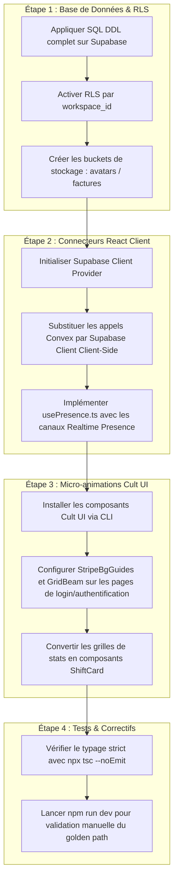

# Handoff Report — Minerva OS Ecosystème Agency OS & AGI (Version Approfondie + Widgets IA & Productivité)

Ce document présente l'analyse technique exhaustive, le schéma relationnel complet et le plan d'architecture approfondi pour **Minerva OS** (Next.js 15 + Tailwind CSS v4 + Supabase backend). Il est enrichi pour maximiser l'usage des composants animés **Cult UI** dans le système de design *Celestial Editorial Noir* et couvrir l'intégration des widgets d'IA, de productivité, d'onboarding, et d'interaction client.

---

## 0. Architecture de la Migration Supabase

La migration implique de passer du backend serverless Convex à un schéma relationnel PostgreSQL complet hébergé sur Supabase, avec l'extension `pgvector` pour la recherche RAG et **Supabase Realtime** pour la présence temps réel et la synchronisation collaborative.

### 0.1. Schéma Relational PostgreSQL Complet (SQL DDL)

Exécutez ce script DDL dans l'éditeur SQL de votre projet Supabase (référence projet : `kcwdmufkyjsitsuxmqld`). Ce script crée l'ensemble des tables en convertissant les structures camelCase de Convex en snake_case PostgreSQL indexé :

```sql
-- Activer les extensions de base
create extension if not exists vector;
create extension if not exists "uuid-ossp";

-- 1. Table des Organisations
create table organizations (
  id uuid primary key default uuid_generate_v4(),
  name text not null,
  logo_url text,
  billing_email text not null,
  created_at timestamp with time zone default timezone('utc'::text, now()) not null
);

-- 2. Table des Workspaces
create table workspaces (
  id uuid primary key default uuid_generate_v4(),
  org_id uuid references organizations(id) on delete cascade,
  name text not null,
  slug text not null unique,
  branding jsonb not null default '{"primaryColor": "#7FA38A", "theme": "dark"}'::jsonb,
  settings jsonb not null default '{"currency": "USD", "language": "en", "timezone": "UTC", "taxRules": []}'::jsonb,
  owner_user_id uuid,
  created_at timestamp with time zone default timezone('utc'::text, now()) not null
);
create index idx_workspaces_slug on workspaces(slug);

-- 3. Table des Profils Utilisateurs (user_profiles)
create table user_profiles (
  id uuid primary key default uuid_generate_v4(),
  user_id uuid unique, -- Clé étrangère vers auth.users de Supabase
  workspace_id uuid references workspaces(id) on delete set null,
  email text not null unique,
  name text not null,
  role text not null check (role in ('owner', 'strategist', 'project_manager', 'designer', 'developer', 'finance', 'client_stakeholder', 'client_reviewer')),
  avatar_url text,
  onboarding_completed boolean default false,
  onboarding_tour_completed boolean default false,
  completed_checklist text[] default '{}'::text[],
  created_at timestamp with time zone default timezone('utc'::text, now()) not null
);
create index idx_user_profiles_user on user_profiles(user_id);
create index idx_user_profiles_workspace on user_profiles(workspace_id);

-- 4. Table des Clients
create table clients (
  id uuid primary key default uuid_generate_v4(),
  workspace_id uuid not null references workspaces(id) on delete cascade,
  company text not null,
  contact text not null,
  email text not null,
  status text not null check (status in ('active', 'lead', 'inactive')),
  monthly_value numeric(10, 2) default 0.00,
  created_at timestamp with time zone default timezone('utc'::text, now()) not null
);
create index idx_clients_workspace on clients(workspace_id);

-- 5. Table des Projets
create table projects (
  id uuid primary key default uuid_generate_v4(),
  workspace_id uuid not null references workspaces(id) on delete cascade,
  client_id uuid references clients(id) on delete set null,
  client_name text not null,
  name text not null,
  status text not null check (status in ('active', 'completed', 'on_hold')),
  due_date date not null,
  budget numeric(12, 2) not null,
  description text,
  health_score int default 100 check (health_score >= 0 and health_score <= 100),
  active_risk_flags text[] default '{}'::text[],
  embedding vector(1536),
  created_at timestamp with time zone default timezone('utc'::text, now()) not null
);
create index idx_projects_workspace on projects(workspace_id);
create index idx_projects_client on projects(client_id);

-- 6. Table des Tâches
create table tasks (
  id uuid primary key default uuid_generate_v4(),
  workspace_id uuid not null references workspaces(id) on delete cascade,
  project_id uuid references projects(id) on delete cascade,
  title text not null,
  description text,
  status text not null check (status in ('todo', 'in_progress', 'review', 'done')),
  priority text not null check (priority in ('low', 'medium', 'high', 'urgent')),
  assignee text not null,
  due_date date not null,
  created_at timestamp with time zone default timezone('utc'::text, now()) not null
);
create index idx_tasks_project on tasks(project_id);
create index idx_tasks_workspace on tasks(workspace_id);

-- 7. Table des Approbations (approvals)
create table approvals (
  id uuid primary key default uuid_generate_v4(),
  workspace_id uuid references workspaces(id) on delete cascade,
  project_id uuid not null references projects(id) on delete cascade,
  name text not null,
  type text not null check (type in ('design', 'copy', 'video', 'document')),
  status text not null check (status in ('pending', 'approved', 'revision')),
  submitted_date timestamp with time zone default timezone('utc'::text, now()) not null,
  file_url text,
  created_at timestamp with time zone default timezone('utc'::text, now()) not null
);
create index idx_approvals_project on approvals(project_id);
create index idx_approvals_workspace on approvals(workspace_id);

-- 8. Table des Commentaires (comments)
create table comments (
  id uuid primary key default uuid_generate_v4(),
  workspace_id uuid references workspaces(id) on delete cascade,
  target_id uuid not null, -- ID de la tâche, de l'approbation, etc.
  target_type text not null check (target_type in ('approval', 'task')),
  author text not null,
  content text not null,
  timestamp timestamp with time zone default timezone('utc'::text, now()) not null
);
create index idx_comments_target on comments(target_type, target_id);

-- 9. Table des Notifications
create table notifications (
  id uuid primary key default uuid_generate_v4(),
  workspace_id uuid references workspaces(id) on delete cascade,
  user_id uuid not null, -- Email ou ID de l'utilisateur cible
  title text not null,
  message text not null,
  type text not null check (type in ('mention', 'status_change', 'task_assigned')),
  read boolean default false not null,
  target_url text,
  timestamp timestamp with time zone default timezone('utc'::text, now()) not null
);
create index idx_notifications_user_unread on notifications(user_id) where read = false;

-- 10. Table des Appels (calls)
create table calls (
  id uuid primary key default uuid_generate_v4(),
  workspace_id uuid references workspaces(id) on delete cascade,
  title text not null,
  start_time timestamp with time zone not null,
  end_time timestamp with time zone not null,
  attendees text[] default '{}'::text[] not null,
  status text not null check (status in ('upcoming', 'completed', 'prepped')),
  summary text,
  notes_url text,
  prep_checklist jsonb default '[]'::jsonb not null,
  created_at timestamp with time zone default timezone('utc'::text, now()) not null
);
create index idx_calls_workspace on calls(workspace_id);

-- 11. Table des Finances (finances)
create table finances (
  id uuid primary key default uuid_generate_v4(),
  workspace_id uuid references workspaces(id) on delete cascade,
  type text not null check (type in ('income', 'expense')),
  amount numeric(12, 2) not null,
  category text not null,
  date date not null,
  description text not null,
  tps numeric(10, 2) default 0.00 not null,
  tvq numeric(10, 2) default 0.00 not null,
  status text not null,
  created_at timestamp with time zone default timezone('utc'::text, now()) not null
);
create index idx_finances_workspace on finances(workspace_id);

-- 12. Table des Livrables de Fulfillment (fulfillment)
create table fulfillment (
  id uuid primary key default uuid_generate_v4(),
  workspace_id uuid references workspaces(id) on delete cascade,
  project_id uuid not null references projects(id) on delete cascade,
  service_type text not null,
  status text not null,
  progress numeric(5, 2) default 0.00 not null,
  checklist jsonb default '[]'::jsonb not null,
  created_at timestamp with time zone default timezone('utc'::text, now()) not null
);
create index idx_fulfillment_workspace on fulfillment(workspace_id);

-- 13. Table des Opportunités (deals)
create table deals (
  id uuid primary key default uuid_generate_v4(),
  workspace_id uuid references workspaces(id) on delete cascade,
  company text not null,
  contact text not null,
  email text not null,
  value numeric(12, 2) not null,
  stage text not null check (stage in ('new_lead', 'qualified', 'proposal', 'negotiation', 'won', 'lost')),
  notes text,
  last_contact timestamp with time zone not null,
  created_at timestamp with time zone default timezone('utc'::text, now()) not null
);
create index idx_deals_workspace on deals(workspace_id);

-- 14. Table des Factures (invoices)
create table invoices (
  id uuid primary key default uuid_generate_v4(),
  workspace_id references workspaces(id) on delete cascade,
  client_id uuid not null references clients(id) on delete cascade,
  invoice_number text not null,
  amount numeric(12, 2) not null,
  status text not null check (status in ('paid', 'pending', 'overdue', 'draft')),
  date date not null,
  due_date date not null,
  items jsonb default '[]'::jsonb not null,
  paid_date date,
  tps numeric(10, 2) default 0.00 not null,
  tvq numeric(10, 2) default 0.00 not null,
  created_at timestamp with time zone default timezone('utc'::text, now()) not null
);
create index idx_invoices_workspace on invoices(workspace_id);
create index idx_invoices_client on invoices(client_id);

-- 15. Table des Assets & Fichiers (assets)
create table assets (
  id uuid primary key default uuid_generate_v4(),
  workspace_id uuid references workspaces(id) on delete cascade,
  name text not null,
  type text not null check (type in ('image', 'video', 'document', 'other')),
  size int not null,
  url text not null,
  project_id uuid references projects(id) on delete set null,
  client_id uuid references clients(id) on delete set null,
  uploaded_at timestamp with time zone default timezone('utc'::text, now()) not null
);
create index idx_assets_workspace on assets(workspace_id);

-- 16. Table des Milestones (milestones)
create table milestones (
  id uuid primary key default uuid_generate_v4(),
  workspace_id uuid references workspaces(id) on delete cascade,
  project_id uuid not null references projects(id) on delete cascade,
  title text not null,
  due_date date not null,
  status text not null check (status in ('upcoming', 'completed', 'overdue')),
  created_at timestamp with time zone default timezone('utc'::text, now()) not null
);
create index idx_milestones_project on milestones(project_id);

-- 17. Table des Jetons de Portail Client (portal_tokens)
create table portal_tokens (
  id uuid primary key default uuid_generate_v4(),
  workspace_id uuid references workspaces(id) on delete cascade,
  client_id uuid not null references clients(id) on delete cascade,
  token text not null unique,
  expires_at timestamp with time zone not null,
  scopes text[] default '{"approvals", "files"}'::text[] not null,
  created_at timestamp with time zone default timezone('utc'::text, now()) not null
);

-- 18. Table d'Activité Générale (activity)
create table activity (
  id uuid primary key default uuid_generate_v4(),
  workspace_id uuid references workspaces(id) on delete cascade,
  username text not null,
  action_name text not null,
  target_name text not null,
  entity_type text not null,
  created_at timestamp with time zone default timezone('utc'::text, now()) not null
);
create index idx_activity_workspace on activity(workspace_id);

-- 19. Table des Services (services)
create table services (
  id uuid primary key default uuid_generate_v4(),
  workspace_id uuid references workspaces(id) on delete cascade,
  name text not null,
  description text not null,
  base_price numeric(10, 2) not null,
  category text not null,
  created_at timestamp with time zone default timezone('utc'::text, now()) not null
);

-- 20. Table des Packages (packages)
create table packages (
  id uuid primary key default uuid_generate_v4(),
  workspace_id uuid references workspaces(id) on delete cascade,
  name text not null,
  description text not null,
  services uuid[] default '{}'::uuid[] not null,
  total_price numeric(12, 2) not null,
  created_at timestamp with time zone default timezone('utc'::text, now()) not null
);

-- 21. Table des Tickets de Support (tickets)
create table tickets (
  id uuid primary key default uuid_generate_v4(),
  workspace_id uuid references workspaces(id) on delete cascade,
  client_id uuid not null references clients(id) on delete cascade,
  subject text not null,
  description text not null,
  status text not null check (status in ('open', 'in_progress', 'resolved', 'closed')),
  priority text not null check (priority in ('low', 'medium', 'high', 'urgent')),
  category text not null check (category in ('bug', 'feature', 'question', 'billing')),
  assigned_to uuid references user_profiles(id) on delete set null,
  sla_deadline timestamp with time zone,
  created_at timestamp with time zone default timezone('utc'::text, now()) not null
);
create index idx_tickets_workspace on tickets(workspace_id);

-- 22. Table des Politiques de SLA (sla_policies)
create table sla_policies (
  id uuid primary key default uuid_generate_v4(),
  workspace_id uuid references workspaces(id) on delete cascade,
  name text not null,
  response_time int not null, -- En minutes
  resolution_time int not null, -- En minutes
  priority text not null unique
);

-- 23. Table des Agents (agents)
create table agents (
  id uuid primary key default uuid_generate_v4(),
  workspace_id uuid references workspaces(id) on delete cascade,
  name text not null,
  role text not null,
  description text not null,
  instructions text not null,
  tools text[] default '{}'::text[] not null,
  status text not null check (status in ('active', 'idle', 'busy')),
  created_at timestamp with time zone default timezone('utc'::text, now()) not null
);

-- 24. Table des Threads d'Agents (agent_threads)
create table agent_threads (
  id uuid primary key default uuid_generate_v4(),
  workspace_id uuid references workspaces(id) on delete cascade,
  agent_id uuid not null references agents(id) on delete cascade,
  title text not null,
  status text not null check (status in ('active', 'archived')),
  metadata jsonb,
  created_at timestamp with time zone default timezone('utc'::text, now()) not null
);

-- 25. Table des Messages d'Agents (agent_messages)
create table agent_messages (
  id uuid primary key default uuid_generate_v4(),
  workspace_id uuid references workspaces(id) on delete cascade,
  thread_id uuid not null references agent_threads(id) on delete cascade,
  role text not null check (role in ('user', 'agent', 'system')),
  content text not null,
  tool_calls jsonb default '[]'::jsonb,
  timestamp timestamp with time zone default timezone('utc'::text, now()) not null
);
create index idx_agent_messages_thread on agent_messages(thread_id);

-- 26. Table des Audits d'Agents (agent_audit)
create table agent_audit (
  id uuid primary key default uuid_generate_v4(),
  workspace_id uuid references workspaces(id) on delete cascade,
  agent_id uuid not null references agents(id) on delete cascade,
  action text not null,
  details jsonb default '{}'::jsonb not null,
  timestamp timestamp with time zone default timezone('utc'::text, now()) not null
);

-- 27. Table des Suggestions de l'IA (agent_suggestions)
create table agent_suggestions (
  id uuid primary key default uuid_generate_v4(),
  workspace_id uuid not null references workspaces(id) on delete cascade,
  agent_id uuid not null references agents(id) on delete cascade,
  title text not null,
  description text not null,
  action_type text not null,
  action_data jsonb not null,
  status text not null check (status in ('pending', 'approved', 'rejected')),
  reasoning text,
  created_at timestamp with time zone default timezone('utc'::text, now()) not null
);
create index idx_suggestions_workspace_pending on agent_suggestions(workspace_id) where status = 'pending';

-- 28. Table des Retours sur Suggestions (agent_feedback)
create table agent_feedback (
  id uuid primary key default uuid_generate_v4(),
  workspace_id uuid references workspaces(id) on delete cascade,
  suggestion_id uuid not null references agent_suggestions(id) on delete cascade,
  user_id uuid not null references user_profiles(id) on delete cascade,
  rating int check (rating >= 1 and rating <= 5) not null,
  comment text,
  timestamp timestamp with time zone default timezone('utc'::text, now()) not null
);

-- 29. Table Base de Connaissances (knowledge_base)
create table knowledge_base (
  id uuid primary key default uuid_generate_v4(),
  workspace_id uuid references workspaces(id) on delete cascade,
  title text not null,
  content text not null,
  category text not null,
  tags text[] default '{}'::text[] not null,
  embedding vector(1536),
  created_at timestamp with time zone default timezone('utc'::text, now()) not null
);

-- 30. Table des Drapeaux de Risques (risk_flags)
create table risk_flags (
  id uuid primary key default uuid_generate_v4(),
  workspace_id uuid references workspaces(id) on delete cascade,
  project_id uuid references projects(id) on delete cascade,
  client_id uuid references clients(id) on delete cascade,
  type text not null check (type in ('timeline', 'scope', 'approval', 'relation', 'finance')),
  severity text not null check (severity in ('low', 'medium', 'high')),
  summary text not null,
  details text not null,
  status text not null check (status in ('active', 'mitigated', 'resolved')),
  created_at timestamp with time zone default timezone('utc'::text, now()) not null
);
create index idx_risk_flags_project on risk_flags(project_id);

-- 31. Table des Résumés d'IA (ai_summaries)
create table ai_summaries (
  id uuid primary key default uuid_generate_v4(),
  workspace_id uuid references workspaces(id) on delete cascade,
  project_id uuid references projects(id) on delete cascade,
  client_id uuid references clients(id) on delete cascade,
  risk_flag_id uuid references risk_flags(id) on delete cascade,
  type text not null check (type in ('mitigation_plan', 'health_report', 'project_summary')),
  content text not null,
  timestamp timestamp with time zone default timezone('utc'::text, now()) not null
);

-- 32. Table des Brouillons d'E-mails (email_drafts)
create table email_drafts (
  id uuid primary key default uuid_generate_v4(),
  workspace_id uuid references workspaces(id) on delete cascade,
  client_id uuid not null references clients(id) on delete cascade,
  subject text not null,
  body text not null,
  recipient_email text not null,
  status text not null check (status in ('draft', 'sent', 'archived')),
  source text not null,
  timestamp timestamp with time zone default timezone('utc'::text, now()) not null
);

-- 33. Table des Notes de Projets (project_notes)
create table project_notes (
  id uuid primary key default uuid_generate_v4(),
  workspace_id uuid references workspaces(id) on delete cascade,
  project_id uuid not null references projects(id) on delete cascade,
  title text not null,
  content text not null,
  author text not null,
  timestamp timestamp with time zone default timezone('utc'::text, now()) not null
);

-- 34. Table des Propositions (proposals)
create table proposals (
  id uuid primary key default uuid_generate_v4(),
  workspace_id uuid references workspaces(id) on delete cascade,
  deal_id uuid references deals(id) on delete set null,
  client_id uuid references clients(id) on delete set null,
  title text not null,
  sections jsonb default '[]'::jsonb not null,
  service_ids text[] default '{}'::text[] not null,
  total_amount numeric(12, 2) not null,
  status text not null check (status in ('draft', 'sent', 'signed', 'declined')),
  token text not null unique,
  sent_at timestamp with time zone,
  signed_at timestamp with time zone,
  signed_by text,
  valid_until timestamp with time zone,
  created_at timestamp with time zone default timezone('utc'::text, now()) not null
);
create index idx_proposals_workspace on proposals(workspace_id);

-- 35. Table des Disponibilités (member_availability)
create table member_availability (
  id uuid primary key default uuid_generate_v4(),
  workspace_id uuid references workspaces(id) on delete cascade,
  user_id uuid not null references user_profiles(id) on delete cascade,
  display_name text not null,
  weekly_hours numeric(5,2) not null,
  role text,
  created_at timestamp with time zone default timezone('utc'::text, now()) not null
);

-- 36. Table des Réponses NPS (nps_responses)
create table nps_responses (
  id uuid primary key default uuid_generate_v4(),
  workspace_id uuid references workspaces(id) on delete cascade,
  client_id uuid not null references clients(id) on delete cascade,
  score int check (score >= 0 and score <= 10) not null,
  reason text,
  suggestion text,
  trigger_event text not null, -- 'phase_complete' | 'delivery' | 'renewal' | 'manual'
  responded_at timestamp with time zone default timezone('utc'::text, now()) not null
);

-- 37. Table des Jetons Push (push_tokens)
create table push_tokens (
  id uuid primary key default uuid_generate_v4(),
  workspace_id uuid references workspaces(id) on delete cascade,
  user_id uuid not null references user_profiles(id) on delete cascade,
  token text not null,
  platform text not null check (platform in ('ios', 'android')),
  registered_at timestamp with time zone default timezone('utc'::text, now()) not null
);

-- 38. Table des Invitations
create table invitations (
  id uuid primary key default uuid_generate_v4(),
  workspace_id uuid references workspaces(id) on delete cascade,
  token text not null unique,
  email text not null,
  role text not null check (role in ('owner', 'member')),
  expires_at timestamp with time zone not null,
  accepted_at timestamp with time zone
);

-- 39. Table des Dépenses (expenses)
create table expenses (
  id uuid primary key default uuid_generate_v4(),
  workspace_id uuid references workspaces(id) on delete cascade,
  submitted_by uuid not null references user_profiles(id) on delete cascade,
  amount numeric(12, 2) not null,
  currency text default 'USD'::text not null,
  category text not null,
  description text not null,
  date date not null,
  receipt_storage_id text,
  status text not null check (status in ('pending', 'approved', 'rejected')),
  approved_by uuid references user_profiles(id) on delete set null,
  project_id uuid references projects(id) on delete set null,
  client_id uuid references clients(id) on delete set null,
  created_at timestamp with time zone default timezone('utc'::text, now()) not null
);
create index idx_expenses_workspace on expenses(workspace_id);
```

### 0.2. Row Level Security (RLS) & Isolation

L'isolation multi-tenant stricte par `workspace_id` est assurée par RLS. Voici la règle pour interdire toute fuite de données inter-workspace sur les tables de l'application :

```sql
-- Exemple : Activation RLS sur la table des clients
alter table clients enable row level security;

create policy "Users can read clients in their workspace"
  on clients for select
  using (
    workspace_id = (
      select workspace_id from user_profiles
      where user_profiles.user_id = auth.uid()
    )
  );

create policy "Workspace owners or managers can modify clients"
  on clients for all
  using (
    workspace_id = (
      select workspace_id from user_profiles
      where user_profiles.user_id = auth.uid()
    )
  )
  with check (
    exists (
      select 1 from user_profiles
      where user_profiles.user_id = auth.uid()
      and role in ('owner', 'project_manager')
    )
  );
```

### 0.3. Profiling Automatique via Triggers Auth

Pour lier les inscriptions Supabase Auth à l'application sans action manuelle complexe :

```sql
create or replace function public.handle_new_user()
returns trigger as $$
begin
  insert into public.user_profiles (user_id, email, name, role, onboarding_completed)
  values (
    new.id,
    new.email,
    coalesce(new.raw_user_meta_data->>'name', split_part(new.email, '@', 1)),
    'owner', -- Assignation par défaut du premier créateur
    false
  );
  return new;
end;
$$ language plpgsql security definer;

create trigger on_auth_user_created
  after insert on auth.users
  for each row execute procedure public.handle_new_user();
```

---

## 1. Audit Visual & Thème (Celestial Editorial Noir)

### 1.1. Correction du Thème Sombre Global
* **Problème :** Si le client OS est configuré en mode clair, l'application s'affiche sur fond blanc, ce qui enfreint la règle non-négociable du design system *Noir* d'Uprising Studio.
* **Fichier :** [theme.tsx](file:///c:/Users/upris/Minerva%20OS/minerva-os/src/theme.tsx)
* **Correction :** Force `'dark'` comme seul état initial :
```typescript
function getInitialTheme(): Theme {
  return 'dark'; // Thème sombre forcé sans exception
}
```

### 1.2. Grille KPI Mobile
* **Fichier :** [Dashboard.tsx](file:///c:/Users/upris/Minerva%20OS/minerva-os/src/modules/app/Dashboard.tsx) (ligne 418)
* **Correction :** Ajuster la grille : `<div className="grid grid-cols-2 md:grid-cols-2 lg:grid-cols-4 gap-4">` et utiliser des classes de taille de texte fluides pour prévenir les coupures visuelles.

---

## 2. Intégration Massive de Cult UI (Aesthetic & UX Upgrade)

Cult UI apporte une finition cinématique extrêmement premium à l'interface via des effets animés lents basés sur `motion/react` et `@tailwindcss/vite` dans Tailwind v4.

### 2.1. Installation des Composants Requis
Installez l'ensemble des modules d'interactions Cult UI depuis leur registre respectif :
```bash
# Layout & Visual Primitives
npx shadcn@latest add https://cult-ui.com/r/stripe-bg-guides.json
npx shadcn@latest add https://cult-ui.com/r/edge-blur.json
npx shadcn@latest add https://cult-ui.com/r/texture-overlay.json

# Navigation & Menus
npx shadcn@latest add https://cult-ui.com/r/dock.json

# Interactions & Formulaires
npx shadcn@latest add https://cult-ui.com/r/texture-button.json
npx shadcn@latest add https://cult-ui.com/r/morph-surface.json
npx shadcn@latest add https://cult-ui.com/r/popover.json

# Onboarding & Tutorials
npx shadcn@latest add https://cult-ui.com/r/intro-disclosure.json
npx shadcn@latest add https://cult-ui.com/r/onboarding.json

# Visualisations de Données & Productivité
npx shadcn@latest add https://cult-ui.com/r/shift-card.json
npx shadcn@latest add https://cult-ui.com/r/expandable.json
npx shadcn@latest add https://cult-ui.com/r/expandable-screen.json
npx shadcn@latest add https://cult-ui.com/r/terminal-animation.json
npx shadcn@latest add https://cult-ui.com/r/sortable-list.json
```

### 2.2. Plan d'Intégration et Emplacement des Primitives Cult UI

| Composant Cult UI | Rôle Visual / Fonctionnel | Fichier / Section d'Intégration |
| :--- | :--- | :--- |
| **Stripe Bg Guides** | Tracé de lignes verticales fines en arrière-plan. | [Landing.tsx](file:///c:/Users/upris/Minerva%20OS/minerva-os/src/Landing.tsx) & [Login.tsx](file:///c:/Users/upris/Minerva%20OS/minerva-os/src/Login.tsx) |
| **Edge Blur** | Masquage de dégradé de flou en haut et en bas des listes défilantes. | [AppShell.tsx](file:///c:/Users/upris/Minerva%20OS/minerva-os/src/components/layout/AppShell.tsx) & [Tasks.tsx](file:///c:/Users/upris/Minerva%20OS/minerva-os/src/modules/app/Tasks.tsx) |
| **Texture Overlay** | Grain papier / bruit discret superposé sur les surfaces. | [Login.tsx](file:///c:/Users/upris/Minerva%20OS/minerva-os/src/Login.tsx) & [Dashboard.tsx](file:///c:/Users/upris/Minerva%20OS/minerva-os/src/modules/app/Dashboard.tsx) (cartes) |
| **Dock** | Barre d'outils flottante macOS au bas de l'App Shell. | [AppShell.tsx](file:///c:/Users/upris/Minerva%20OS/minerva-os/src/components/layout/AppShell.tsx) |
| **Texture Button** | Boutons d'actions principaux avec micro-relief. | [Login.tsx](file:///c:/Users/upris/Minerva%20OS/minerva-os/src/Login.tsx), [SignUp.tsx](file:///c:/Users/upris/Minerva%20OS/minerva-os/src/SignUp.tsx), [TimerWidget.tsx](file:///c:/Users/upris/Minerva%20OS/minerva-os/src/components/layout/TimerWidget.tsx) |
| **MorphSurface** | Zone d'édition compacte qui se déploie lors du clic. | [TimerWidget.tsx](file:///c:/Users/upris/Minerva%20OS/minerva-os/src/components/layout/TimerWidget.tsx) (Fast Log) & [AgentSuggestions.tsx](file:///c:/Users/upris/Minerva%20OS/minerva-os/src/components/agents/AgentSuggestions.tsx) |
| **Intro Disclosure** | Carrousel d'onboarding lors de la première connexion. | [Platform.tsx](file:///c:/Users/upris/Minerva%20OS/minerva-os/src/Platform.tsx) (après connexion utilisateur) |
| **Onboarding** | Formulaire multi-étapes pour initialiser l'organisation. | [SignUp.tsx](file:///c:/Users/upris/Minerva%20OS/minerva-os/src/SignUp.tsx) (configuration de l'organisation) |
| **Shift Card** | Effet de parallaxe 3D sur le mouvement du curseur. | [Dashboard.tsx](file:///c:/Users/upris/Minerva%20OS/minerva-os/src/modules/app/Dashboard.tsx) (KPIs supérieurs) |
| **Expandable** | Carte dépliable en accordéon pour résumer le briefing de l'IA. | [Dashboard.tsx](file:///c:/Users/upris/Minerva%20OS/minerva-os/src/modules/app/Dashboard.tsx) (Daily AI Briefing) |
| **ExpandableScreen** | Agrandissement plein écran d'une carte projet vers sa vue Kanban. | [Projects.tsx](file:///c:/Users/upris/Minerva%20OS/minerva-os/src/modules/app/Projects.tsx) (clic sur une carte projet) |
| **Terminal Animation** | Console interactive affichant le flux de logs système de l'IA. | [AgentOps.tsx](file:///c:/Users/upris/Minerva%20OS/minerva-os/src/modules/app/AgentOps.tsx) |
| **Sortable List** | Glisser-déposer de listes ordonnées. | [Tasks.tsx](file:///c:/Users/upris/Minerva%20OS/minerva-os/src/modules/app/Tasks.tsx) (classement par priorité de tâches) |

---

## 3. Spécifications Détaillées des Widgets IA & Productivité

### 3.1. Prompt Library & AI Instructions Panel (AgentOps Suite)
* **Fichier :** [AgentOps.tsx](file:///c:/Users/upris/Minerva%20OS/minerva-os/src/modules/app/AgentOps.tsx)
* **Prompt Library :** Galerie de prompts réutilisables permettant aux gestionnaires de projets d'injecter des instructions typées d'IA.
* **AI Instructions Editor :** Utilise `MorphSurface` pour modifier dynamiquement les prompts système des agents IA directement depuis le tableau de bord de supervision.

### 3.2. Timer Widget (Productivité de l'Équipe)
* **Fichier :** [TimerWidget.tsx](file:///c:/Users/upris/Minerva%20OS/minerva-os/src/components/layout/TimerWidget.tsx)
* **Fini visuel :** Affiche un widget circulaire doté d'une animation oscillante lente qui suit l'écoulement des secondes, connecté directement à la table `active_timers` via Supabase Realtime.

### 3.3. Sortable List, Choice Poll & Vote Tally (Livrables & Approbations)
* **Fichier :** [Approvals.tsx](file:///c:/Users/upris/Minerva%20OS/minerva-os/src/modules/app/Approvals.tsx) & [PortalOverview.tsx](file:///c:/Users/upris/Minerva%20OS/minerva-os/src/modules/portal/PortalOverview.tsx)
* **Choice Poll & Feature Poll :** Les clients votent directement sur des propositions de design ou donnent une note de satisfaction NPS via un composant de vote instantané Cult UI.
* **Vote Tally :** Calcule en temps réel le décompte des votes du comité client (Approuvé, Demande de révisions, Rejeté) avec des barres de progression animées.

---

## 4. Implémentation Logiciel & Couche AGI (Supabase Edge Functions)

### 4.1. Résolution de l'Approbation de l'IA (Moteur d'Actions)

Lorsque l'utilisateur approuve une suggestion IA via [AgentSuggestions.tsx](file:///c:/Users/upris/Minerva%20OS/minerva-os/src/components/agents/AgentSuggestions.tsx), nous appelons le service Supabase pour modifier le statut à `'approved'`.
Le trigger SQL PostgreSQL suivant prend ensuite le relais pour créer l'entité correspondante en base de données :

```sql
create or replace function execute_approved_agent_suggestion()
returns trigger as $$
declare
  data_payload jsonb;
begin
  if new.status = 'approved' and old.status = 'pending' then
    data_payload := new.action_data;
    
    -- 1. Action : Création automatique d'une tâche
    if new.action_type = 'create_task' then
      insert into tasks (workspace_id, project_id, title, description, status, priority, assignee, due_date)
      values (
        new.workspace_id,
        (data_payload->>'project_id')::uuid,
        data_payload->>'title',
        data_payload->>'description',
        'todo',
        data_payload->>'priority',
        data_payload->>'assignee',
        (data_payload->>'due_date')::date
      );
      
    -- 2. Action : Mise à jour du pipeline des ventes (Deals)
    elsif new.action_type = 'update_deal_stage' then
      update deals
      set stage = data_payload->>'stage'
      where id = (data_payload->>'deal_id')::uuid;
      
    -- 3. Action : Insertion automatique de note projet
    elsif new.action_type = 'create_project_note' then
      insert into project_notes (workspace_id, project_id, title, content, author)
      values (
        new.workspace_id,
        (data_payload->>'project_id')::uuid,
        data_payload->>'title',
        data_payload->>'content',
        'AGI Agent'
      );
    end if;

    -- Journaliser dans l'activité globale
    insert into activity (workspace_id, username, action_name, target_name, entity_type)
    values (new.workspace_id, 'AGI Agent', 'executed_suggestion', new.title, 'agent_suggestion');
  end if;
  return new;
end;
$$ language plpgsql;

create trigger tr_execute_agent_suggestion
  after update on agent_suggestions
  for each row
  execute function execute_approved_agent_suggestion();
```

### 4.2. Recherche Sémantique et Vectorielle (pgvector RAG)

Pour la Command Palette et la Base de Connaissances, la recherche textuelle simple (`LIKE`) doit être doublée par une recherche de similarité cosinus sur les embeddings générés par l'IA.

```sql
create or replace function match_knowledge_base (
  query_embedding vector(1536),
  match_threshold float,
  match_count int,
  filter_workspace_id uuid
)
returns table (
  id uuid,
  title text,
  content text,
  category text,
  similarity float
)
language plpgsql as $$
begin
  return query
  select
    kb.id,
    kb.title,
    kb.content,
    kb.category,
    1 - (kb.embedding <=> query_embedding) as similarity
  from knowledge_base kb
  where kb.workspace_id = filter_workspace_id
  and 1 - (kb.embedding <=> query_embedding) > match_threshold
  order by kb.embedding <=> query_embedding
  limit match_count;
end;
$$;
```

---

## 5. Plan de Traduction i18n & Intégration Textes (Anglais / Français)

Toutes les chaînes visibles doivent impérativement transiter par `src/i18n.tsx`. Voici les clés additionnelles à injecter :

```typescript
// src/i18n.tsx
export const i18n = {
  en: {
    billing: {
      newRetainer: "New Retainer",
      retainersList: "Retainer Agreements",
      hoursIncluded: "Hours Included",
      hoursUsed: "Hours Used",
      cycle: "Billing Cycle",
      statusActive: "Active",
      statusPaused: "Paused",
    },
    tickets: {
      title: "Support Tickets",
      createTicket: "Submit Request",
      subject: "Subject",
      category: "Category",
      priority: "Priority",
      open: "Open",
      inProgress: "In Progress",
      resolved: "Resolved",
    }
  },
  fr: {
    billing: {
      newRetainer: "Nouveau Forfait",
      retainersList: "Contrats de Forfait",
      hoursIncluded: "Heures Incluses",
      hoursUsed: "Heures Utilisées",
      cycle: "Cycle de Facturation",
      statusActive: "Actif",
      statusPaused: "En Pause",
    },
    tickets: {
      title: "Tickets de Support",
      createTicket: "Soumettre une Requête",
      subject: "Sujet",
      category: "Catégorie",
      priority: "Priorité",
      open: "Ouvert",
      inProgress: "En Cours",
      resolved: "Résolu",
    }
  }
};
```

---

## 6. Plan d'Exécution Technique et de Déploiement

Le déploiement et la mise en production du backend s'articulent autour de 4 jalons critiques :



---

## Statut Migration Supabase — COMPLET (2026-05-29)

### Ce qui a été accompli

La migration complète de Convex vers Supabase est **terminée**. Voici le récapitulatif :

| Composant | Statut | Notes |
|---|---|---|
| `convex/` folder | Supprimé | Entièrement retiré du repo |
| `src/` (Next.js) | Migré | Tous les modules utilisent `@/lib/supabase` |
| `src/app/forgot-password/page.tsx` | Migré | `supabase.auth.resetPasswordForEmail` |
| `src/app/reset-password/page.tsx` | Migré | `supabase.auth.updateUser` |
| `src/app/offline/page.tsx` | Mis à jour | Référence Convex supprimée |
| `src/components/layout/AppHeader.tsx` | Corrigé | Fix TS18047 user null |
| `src/components/minerva/GettingStartedChecklist.tsx` | Corrigé | Fix `justifyContent` casing |
| `src/lib/supabase/middleware.ts` | Corrigé | Fix TS2345 cookie setAll signature |
| `src/modules/app/AppSettings.tsx` | Migré | PrivacyTab migré vers Supabase REST |
| `src/modules/app/TimeTracking.tsx` | Corrigé | Fix TS6133 unused `endTime` |
| `src/modules/portal/usePortalData.ts` | Corrigé | Fix TS6133 unused `workspaceId` |
| `minerva-mcp/` | Migré | Supabase client, tsc clean |
| `minerva-mobile/` | Migré | `convex.ts` stub, NativeWind types ajoutés |
| `scripts/dev.bat` | Nouveau | Lanceur interactif Windows |
| `scripts/dev.sh` | Mis à jour | Référence Supabase, Convex retiré |
| `tests/audit/*.spec.ts` | Mis à jour | Filtres de console logs Supabase |
| `package.json` (root) | Nettoyé | Dépendances Convex retirées |
| `package.json` (mobile) | Nettoyé | Dépendances Convex retirées |
| `npx tsc --noEmit` (main app) | ZERO ERREUR | |
| `npx tsc --noEmit` (minerva-mcp) | ZERO ERREUR | |

### Lancer en développement local (Windows)

Double-cliquez sur `scripts/dev.bat` ou lancez-le depuis un terminal :

```bat
scripts\dev.bat
```

Un menu interactif s'affichera avec 4 options :

| Option | Description |
|---|---|
| `[1] Web App` | Next.js sur `http://localhost:3000` |
| `[2] Electron` | Compile electron/main.ts + ouvre la fenêtre desktop |
| `[3] Mobile` | Expo Go (QR code), émulateur Android ou iOS |
| `[4] MCP Server` | Compile et lance le serveur MCP stdio pour Claude Desktop |
| `[5] Tout installer` | `npm install` dans root, minerva-mcp, minerva-mobile |

### Variables d'environnement requises

**`.env.local` (racine du projet)** :
```env
NEXT_PUBLIC_SUPABASE_URL=https://kcwdmufkyjsitsuxmqld.supabase.co
NEXT_PUBLIC_SUPABASE_PUBLISHABLE_KEY=sb_publishable_fJZzWMwE5Sl1zkr9h7fiLQ_6-OOCDIB
```

**`minerva-mobile/.env.local`** :
```env
EXPO_PUBLIC_SUPABASE_URL=https://kcwdmufkyjsitsuxmqld.supabase.co
EXPO_PUBLIC_SUPABASE_ANON_KEY=votre_cle_anon
```

**`minerva-mcp/` (variables d'environnement système ou .env)** :
```env
SUPABASE_URL=https://kcwdmufkyjsitsuxmqld.supabase.co
SUPABASE_KEY=votre_cle_anon
```

### Prochaines etapes suggérées

1. **Activer RLS Supabase** — configurer les politiques Row Level Security pour `workspace_id` sur toutes les tables
2. **Auth callbacks** — configurer la redirection Supabase OAuth dans `src/app/api/auth/callback/route.ts`
3. **Realtime** — implémenter `usePresence.ts` avec les canaux Supabase Realtime pour la collaboration
4. **Mobile Expo** — créer `minerva-mobile/.env.local` avec les vraies clés Supabase
5. **Claude Desktop MCP** — pointer `claude_desktop_config.json` vers `minerva-mcp/dist/server.js`

